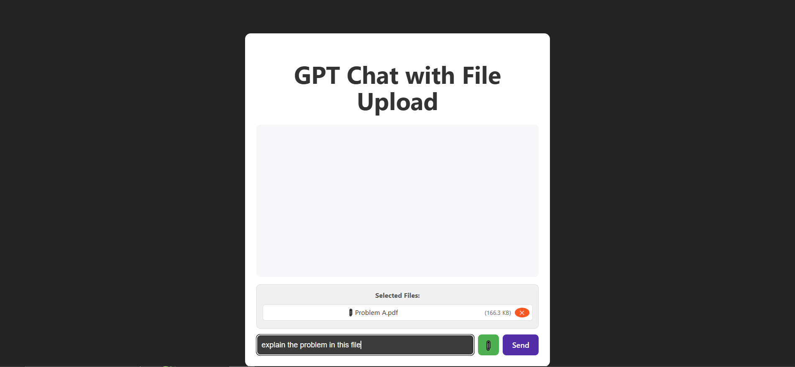
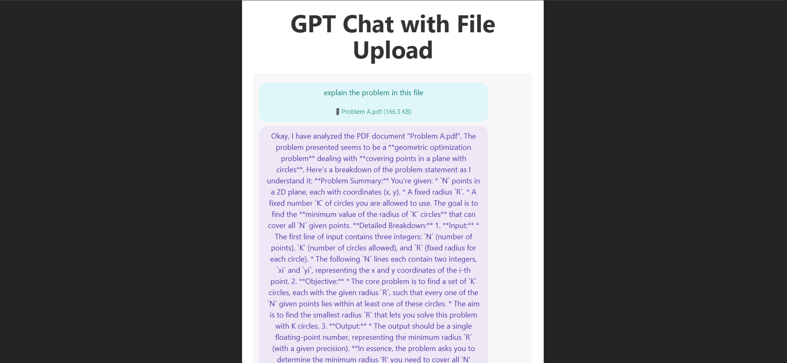

## AI Lab 2





# React + TypeScript + Vite

This template provides a minimal setup to get React working in Vite with HMR and some ESLint rules.

Currently, two official plugins are available:

- [@vitejs/plugin-react](https://github.com/vitejs/vite-plugin-react/blob/main/packages/plugin-react) uses [Babel](https://babeljs.io/) for Fast Refresh
- [@vitejs/plugin-react-swc](https://github.com/vitejs/vite-plugin-react/blob/main/packages/plugin-react-swc) uses [SWC](https://swc.rs/) for Fast Refresh

## Expanding the ESLint configuration

If you are developing a production application, we recommend updating the configuration to enable type-aware lint rules:

```js
export default tseslint.config([
  globalIgnores(['dist']),
  {
    files: ['**/*.{ts,tsx}'],
    extends: [
      // Other configs...

      // Remove tseslint.configs.recommended and replace with this
      ...tseslint.configs.recommendedTypeChecked,
      // Alternatively, use this for stricter rules
      ...tseslint.configs.strictTypeChecked,
      // Optionally, add this for stylistic rules
      ...tseslint.configs.stylisticTypeChecked,

      // Other configs...
    ],
    languageOptions: {
      parserOptions: {
        project: ['./tsconfig.node.json', './tsconfig.app.json'],
        tsconfigRootDir: import.meta.dirname,
      },
      // other options...
    },
  },
])
```

You can also install [eslint-plugin-react-x](https://github.com/Rel1cx/eslint-react/tree/main/packages/plugins/eslint-plugin-react-x) and [eslint-plugin-react-dom](https://github.com/Rel1cx/eslint-react/tree/main/packages/plugins/eslint-plugin-react-dom) for React-specific lint rules:

```js
// eslint.config.js
import reactX from 'eslint-plugin-react-x'
import reactDom from 'eslint-plugin-react-dom'

export default tseslint.config([
  globalIgnores(['dist']),
  {
    files: ['**/*.{ts,tsx}'],
    extends: [
      // Other configs...
      // Enable lint rules for React
      reactX.configs['recommended-typescript'],
      // Enable lint rules for React DOM
      reactDom.configs.recommended,
    ],
    languageOptions: {
      parserOptions: {
        project: ['./tsconfig.node.json', './tsconfig.app.json'],
        tsconfigRootDir: import.meta.dirname,
      },
      // other options...
    },
  },
])
```

# Full-Stack GPT Chat Application

This project is a full-stack chat application using React (frontend) and Node.js/Express (backend) to connect to the OpenAI GPT API.

## Features
- Modern chat UI (React + Vite + TypeScript)
- Secure backend (Node.js/Express) to handle OpenAI API key
- REST endpoint for chat

## Getting Started

### Backend
1. Go to the `server` folder:
   ```powershell
   cd server
   ```
2. Copy your OpenAI API key into `.env` as `OPENAI_API_KEY`.
3. Install dependencies:
   ```powershell
   npm install
   ```
4. Start the backend server:
   ```powershell
   npm start
   ```

### Frontend
1. In the root folder, install dependencies:
   ```powershell
   npm install
   ```
2. Start the frontend:
   ```powershell
   npm run dev
   ```

The frontend will be available at `http://localhost:5173` and the backend at `http://localhost:5000`.

## Customization
- Update the chat UI in the `src` folder.
- Backend logic is in `server/index.js`.

## License
MIT
